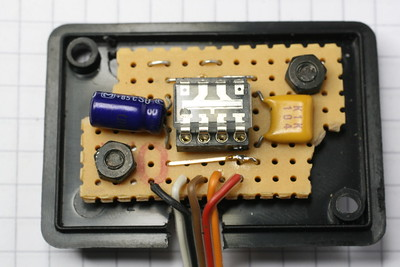

# LineCamera #

Code for a line-scan camera with 128 pixels, based on the TSL1401 sensor.
Part of the code runs on an Arduino connected to the chip,
and the other part runs on a host computer in Processing.

# Hardware #

8-pin DIL chip in transparent package.

